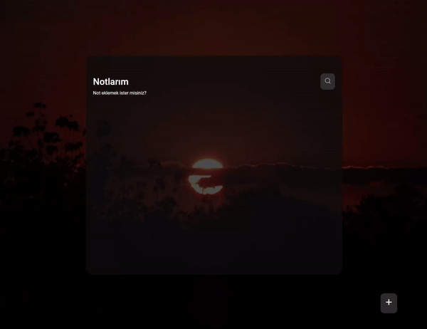

<h1> Notes App React</h1>

 React ve React Router kullanılarak geliştirilmiş bu proje kullanıcıyanot ekleyebilme, mevcut notları düzenleyebilme, silebilme, arama yapabilme, notların oluşturulma tarih ve saatinin gösterildiği, farklı ekran boyutlarına uyumlu, kullanıcı dostu tasarıma sahip, sayfa yönlendirmelerini içeren bir projedir.

<h2> Proje Özellikleri </h2>

<ul>
<li><b>Not Ekleme: </b> Uygulama kullanıcılara başlık ve detay ekleyerek yeni notlar oluşturma imkanı sunar.</li>
<li><b>Not Düzenleme: </b> Oluşturulan notlar üzerinde değişiklik yapma olanağı vardır. Kullanıcılar başlık veya detayı düzenleyebilir. </li>
<li><b>Not Silme: </b> Kullanıcılar artık ihtiyaç duymadıkları notları silebilirler.</li>
<li><b>Arama Özelliği: </b>: Uygulama notlar arasında hızlı ve etkili bir şekilde arama yapma imkanı sunar.</li>
<li><b>Tarih Gösterimi: </b>Her not oluşturulduğu tarih ve saat bilgisiyle birlikte gösterilir</li>
<li><b>Responsive Tasarım: </b>Uygulama farklı cihazlarda ve ekran boyutlarında kullanıcı dostu bir tasarıma sahiptir. </li>
<li><b>Sayfa Yönlendirme: </b>React Router kullanılarak kullanıcılar arasında sayfalar arası geçişler sağlanır.</li>

</ul>

<h2> Kullanilan Teknolojiler </h2>
<ul>
<li>React</li>
<li>React Router Dom</li>
<li>React-icons</li>
<li>JavaScript</li>
<li>Html</li>
<li>Css</li>

</ul>

<h2>Ekran Görüntüsü</h2>

